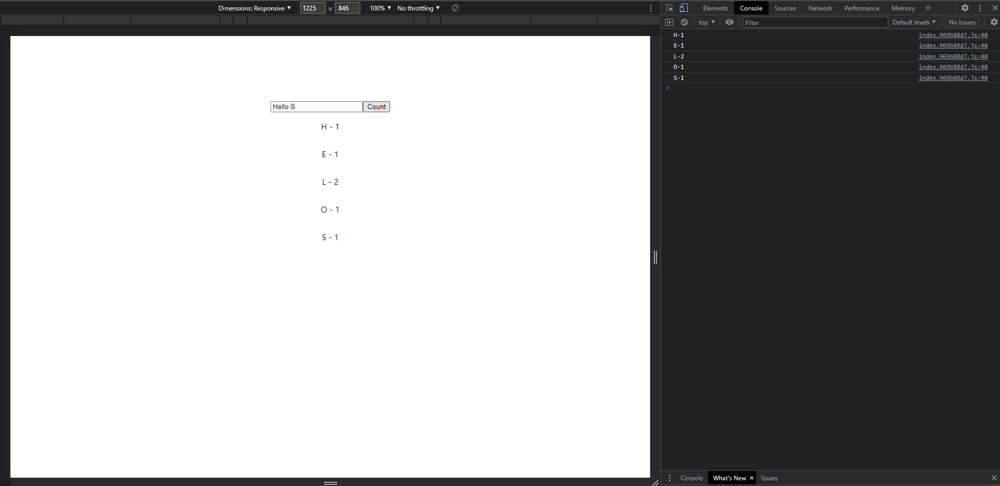

 # Letter Count Output
 
 

  ## Open [https://add-random-user.netlify.app/](https://add-random-user.netlify.app/) to view it in your browser.

  # Add Random Record And Delete Record
 
 

 ## Open [https://add-random-user.netlify.app/](https://add-random-user.netlify.app/) to view it in your browser.
 

 # Getting Started with Create React App

In the project directory, you can run:

### `npm run dev`

Runs the app in the development mode.\
Open [http://localhost:3000](http://localhost:3000) to view it in your browser.

### `npm run build`

# Vite JS

## npm create vite@latest
## cd my-project
## npm install
## npm run dev

For more information about Vite JS
 (https://vitejs.dev/guide/)